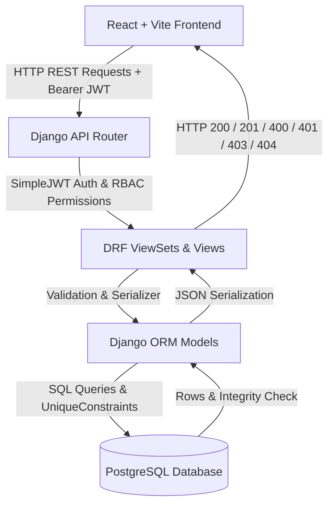
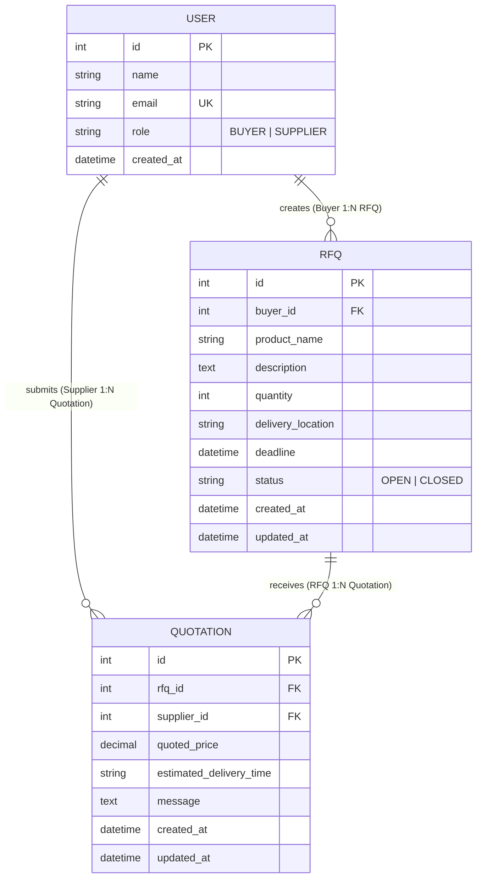

# Mini B2B RFQ Marketplace

A enterprise-grade B2B Request for Quotation (RFQ) Marketplace platform connecting Buyers and Suppliers to post sourcing requests, submit competitive price bids, and manage industrial procurement workflows.

---

## Project Overview

The **Mini B2B RFQ Marketplace** streamlines industrial procurement by enabling **Buyers** to post detailed Request for Quotations (RFQs) with required product quantities, delivery destinations, and deadlines, while allowing verified **Suppliers** to browse active RFQs and submit competitive price bids.

The platform enforces strict role-based access control (RBAC), database-level unique constraints to prevent duplicate supplier bidding, and transparent pricing evaluation for buyers.

---

## Features

### Buyer Features
- **Registration & Authentication**: Sign up as a `BUYER` and log in securely with JWT token authentication.
- **Create RFQ**: Post new sourcing requests specifying product/service name, detailed description, required quantity (`> 0`), delivery destination, and submission deadline.
- **Manage RFQs**: View, edit specifications, or change status (Close/Re-open/Delete) for owned RFQs.
- **View Received Quotations**: Access all price bids submitted by suppliers for owned RFQs alongside lowest quote and average quote statistics.

### Supplier Features
- **Browse Marketplace RFQs**: Discover active `OPEN` buyer RFQs across different delivery destinations.
- **Search & Filter**: Search RFQs by product name and filter by delivery location or status.
- **View Specifications**: Review complete scope of work, quantity requirements, destination, and deadline details.
- **Submit Quotation**: Submit competitive total price bids (`quoted_price > 0`), estimated delivery lead times, and notes.
- **View Submitted Quotations**: Track all submitted price bids across open and past RFQs in a dedicated portal.

---

## Technology Stack

### Frontend
- **Framework**: React 19 (via Vite 8)
- **Styling**: Bootstrap 5 + Bootstrap Icons + Custom CSS (Vanilla CSS for maximum flexibility)
- **HTTP Client**: Axios (with Request/Response Interceptors for Bearer JWT tokens & auto-refresh)
- **Routing**: React Router v7

### Backend
- **Language**: Python 3.10+
- **Framework**: Django 5.x / 6.x
- **API Framework**: Django REST Framework (DRF)
- **Authentication**: SimpleJWT (JSON Web Token Authentication)
- **CORS**: django-cors-headers

### Database
- **Production Engine**: PostgreSQL
- **Development Fallback**: SQLite (Zero-configuration fallback when PostgreSQL env vars are omitted)

---

## Architecture



### Flow Breakdown:
1. **React Frontend**: Renders responsive UI components using React Router and consumes API endpoints via a centralized Axios instance.
2. **REST API Layer**: Django API Router maps endpoint URLs (`/api/auth/`, `/api/rfqs/`, `/api/quotations/`) to DRF ViewSets.
3. **Django REST Framework**: Handles authentication via SimpleJWT, checks role permissions (`IsBuyer`, `IsSupplier`, `IsRFQOwnerOrSupplierReadOnly`), and validates JSON payloads.
4. **PostgreSQL Database**: Persists data models transactionally and enforces integrity rules (`UniqueConstraint(rfq, supplier)`).

---

## Database Design



### Models & Relationships:
- **`User` Model**: Extends Django's `AbstractUser` using `email` as the primary login credential. Defines `role` choices (`BUYER` or `SUPPLIER`).
- **`RFQ` Model**: Represents a buyer sourcing request. Belongs to a single Buyer (`ForeignKey` to `User`). One Buyer can create many RFQs.
- **`Quotation` Model**: Represents a price bid submitted by a Supplier. Linked to an `RFQ` and a `User` (Supplier).
- **Database UniqueConstraint**: `UniqueConstraint(fields=['rfq', 'supplier'], name='unique_rfq_supplier_quotation')` guarantees a supplier can submit only ONE quotation per RFQ at the database engine level.

---

## Authentication & Authorization

### JWT Token Workflow
1. User logs in at `POST /api/auth/login/` with email and password.
2. Backend validates credentials and issues an `access` token (short-lived) and a `refresh` token (long-lived).
3. The React frontend stores tokens in `localStorage` and attaches `Authorization: Bearer <access_token>` to every subsequent API request via Axios request interceptors.
4. If the access token expires (`401 Unauthorized`), the Axios response interceptor calls `POST /api/auth/refresh/` using the refresh token to obtain a new access token seamlessly.

### Role-Based Access Control (RBAC)
- **`IsBuyer`**: Restricts endpoints to users with `role == 'BUYER'`.
- **`IsSupplier`**: Restricts endpoints to users with `role == 'SUPPLIER'`.
- **`IsRFQOwnerOrSupplierReadOnly`**:
  - `POST /api/rfqs/`: Authenticated `BUYER` only.
  - `GET /api/rfqs/`: Buyers see their own RFQs; Suppliers see active `OPEN` RFQs.
  - `PUT / PATCH / DELETE /api/rfqs/{id}/`: Owning `BUYER` only. Non-owners and Suppliers receive `403 Forbidden` or `404 Not Found`.

---

## API Endpoints

| Category | Method | Endpoint Path | Access Level | Description |
| :--- | :--- | :--- | :--- | :--- |
| **Auth** | `POST` | `/api/auth/register/` | Public | Register new user account (`BUYER` or `SUPPLIER`). |
| **Auth** | `POST` | `/api/auth/login/` | Public | Authenticate user & issue JWT tokens. |
| **Auth** | `POST` | `/api/auth/refresh/` | Public | Refresh expired JWT access token. |
| **Auth** | `GET` | `/api/auth/me/` | Authenticated | Retrieve authenticated user profile. |
| **RFQs** | `POST` | `/api/rfqs/` | Buyer | Create a new RFQ (`product_name`, `quantity`, `deadline`, etc.). |
| **RFQs** | `GET` | `/api/rfqs/` | Authenticated | List RFQs (Buyer sees own RFQs; Supplier sees OPEN RFQs). |
| **RFQs** | `GET` | `/api/rfqs/{id}/` | Authenticated | View complete RFQ specifications. |
| **RFQs** | `PUT/PATCH` | `/api/rfqs/{id}/` | RFQ Owner | Update RFQ details or status (`OPEN` / `CLOSED`). |
| **RFQs** | `DELETE` | `/api/rfqs/{id}/` | RFQ Owner | Delete an RFQ. |
| **Quotes** | `POST` | `/api/rfqs/{rfq_id}/quotations/` | Supplier | Submit a price bid for an OPEN RFQ. |
| **Quotes** | `GET` | `/api/rfqs/{rfq_id}/quotations/` | Owner / Supplier | View received quotes for RFQ (Owner sees all; Supplier sees own). |
| **Quotes** | `GET` | `/api/quotations/my/` | Supplier | View all quotations submitted by logged-in supplier. |

---

## Project Structure

```text
B2B-RFQ-Marketplace/
├── .env.example                # Environment variables template
├── .gitignore                  # Git exclusion rules
├── README.md                   # Project documentation
│
├── backend/                    # Django REST API Backend
│   ├── manage.py
│   ├── config/                 # Project configuration
│   │   ├── settings.py         # Django settings & DB config
│   │   ├── urls.py             # Root URL routing
│   │   └── exceptions.py       # Custom DRF exception handler
│   ├── accounts/               # User authentication app
│   │   ├── models.py           # Custom User model (BUYER / SUPPLIER)
│   │   ├── permissions.py      # IsBuyer & IsSupplier permission classes
│   │   ├── serializers.py      # Register & Login serializers
│   │   ├── views.py            # Auth API endpoints
│   │   └── urls.py
│   ├── rfqs/                   # RFQ management app
│   │   ├── models.py           # RFQ model
│   │   ├── permissions.py      # RFQ ownership permissions
│   │   ├── serializers.py      # RFQ serializer & field validations
│   │   ├── views.py            # RFQ ViewSet
│   │   └── urls.py
│   └── quotations/             # Quotation bidding app
│       ├── models.py           # Quotation model & UniqueConstraint
│       ├── permissions.py      # Quotation permissions
│       ├── serializers.py      # Quotation serializer & validations
│       ├── views.py            # Quotation API views
│       └── urls.py
│
└── frontend/                   # React + Vite Frontend
    ├── package.json
    ├── vite.config.js
    ├── index.html
    └── src/
        ├── api/                # Axios client & service calls
        │   ├── axiosClient.js  # Interceptor-enabled Axios instance
        │   ├── authService.js  # Auth API service
        │   ├── rfqService.js   # RFQ API service
        │   └── quotationService.js # Quotation API service
        ├── context/
        │   └── AuthContext.jsx # Global auth state & session restoration
        ├── components/
        │   ├── Navbar.jsx      # Navigation bar with role badges
        │   ├── Footer.jsx      # 3-column enterprise footer
        │   └── ProtectedRoute.jsx # Role-based route guard
        ├── pages/
        │   ├── Home.jsx        # Landing page
        │   ├── Login.jsx       # Login page
        │   ├── Register.jsx    # Registration page
        │   ├── BuyerDashboard.jsx  # Buyer dashboard & live metrics
        │   ├── MyRFQs.jsx      # Buyer RFQ management list
        │   ├── CreateRFQ.jsx   # RFQ creation form
        │   ├── EditRFQ.jsx     # RFQ specification update form
        │   ├── RFQDetails.jsx  # RFQ specifications & received quotes
        │   ├── BuyerQuotations.jsx # Received quotes summary
        │   ├── SupplierDashboard.jsx # Supplier dashboard & metrics
        │   ├── BrowseRFQs.jsx  # Open RFQs marketplace & search/filter
        │   ├── SupplierRFQDetails.jsx # RFQ specs & quote submission form
        │   └── MyQuotations.jsx# Supplier submitted quotes portal
        └── index.css           # Global Bootstrap 5 theme overrides
```

---

## Local Setup

### Step 1: Clone Repository
```bash
git clone https://github.com/pillanagrovikarunakar/B2B-RFQ-Marketplace.git
cd B2B-RFQ-Marketplace
```

### Step 2: Create Python Virtual Environment (Backend)
```bash
cd backend
python -m venv venv
# On Windows:
venv\Scripts\activate
# On macOS/Linux:
source venv/bin/activate
```

### Step 3: Install Dependencies
```bash
pip install django djangorestframework djangorestframework-simplejwt django-cors-headers python-dotenv psycopg2-binary
```

### Step 4: Configure Environment Variables
Copy `.env.example` to `.env` in the root or `backend` folder:
```bash
cp ../.env.example .env
```

### Step 5: Create PostgreSQL Database
Create a local PostgreSQL database named `b2b_rfq_db` (or rely on SQLite fallback if PostgreSQL is not installed locally):
```sql
CREATE DATABASE b2b_rfq_db;
```

### Step 6: Run Database Migrations
```bash
python manage.py makemigrations
python manage.py migrate
```

### Step 7: Create Optional Superuser
```bash
python manage.py createsuperuser
```

### Step 8: Start Backend Server
```bash
python manage.py runserver 8000
```
Backend API will be running at `http://127.0.0.1:8000/api/`.

### Step 9: Install Frontend Dependencies
In a new terminal window:
```bash
cd frontend
npm install
```

### Step 10: Start Frontend Development Server
```bash
npm run dev
```
Frontend app will be running at `http://localhost:5173`.

---

## Environment Variables

The project reads settings dynamically from `.env` using `python-dotenv`:

| Variable | Description | Default / Example |
| :--- | :--- | :--- |
| `SECRET_KEY` | Django secret key for cryptographic signing | `django-insecure-key...` |
| `DEBUG` | Enable/disable Django debug mode (`True` / `False`) | `True` |
| `ALLOWED_HOSTS` | Comma-separated list of allowed hostnames | `localhost,127.0.0.1` |
| `DB_ENGINE` | Database backend engine | `django.db.backends.postgresql` |
| `DB_NAME` | PostgreSQL database name | `b2b_rfq_db` |
| `DB_USER` | PostgreSQL username | `postgres` |
| `DB_PASSWORD` | PostgreSQL password | `your_secure_password` |
| `DB_HOST` | PostgreSQL host address | `localhost` |
| `DB_PORT` | PostgreSQL port | `5432` |
| `CORS_ALLOWED_ORIGINS` | Comma-separated list of allowed CORS origins | `http://localhost:5173,http://127.0.0.1:5173` |

---

## Testing

### Running Unit & API Tests
Execute all Django unit tests across `accounts`, `rfqs`, and `quotations` apps:
```bash
cd backend
python manage.py test
```

### Running Automated E2E Master Audit Script
Run the 51-item automated master audit script covering authentication, permissions, validation errors, and database constraints:
```bash
python scratch/run_e2e_marketplace_tests.py
```

### Running Frontend Production Build Test
Verify React bundle compilation:
```bash
cd frontend
npm run build
```

---

## Deployment

### Backend Deployment (Render & Managed PostgreSQL)

The backend is configured out-of-the-box for seamless deployment to **Render** using Gunicorn, WhiteNoise, and Managed PostgreSQL via `dj-database-url`.

#### 1. Repository Blueprint Setup
1. Push your repository to GitHub/GitLab.
2. In the [Render Dashboard](https://dashboard.render.com/), click **New +** -> **Blueprint**.
3. Connect your repository. Render will automatically detect the [`render.yaml`](file:///c:/Users/KARUNAKAR/OneDrive/Desktop/B2B-RFQ-Marketplace/backend/render.yaml) file in the `backend/` folder and provision:
   - A **Web Service** (`b2b-rfq-marketplace-backend`) using Python runtime.
   - A **PostgreSQL Database** (`b2b-rfq-db`).

#### 2. Manual Web Service Setup (Alternative)
If setting up manually on Render or similar platforms (Heroku, Railway, DigitalOcean):
- **Root Directory**: `backend`
- **Build Command**: `./build.sh` (or `pip install -r requirements.txt && python manage.py collectstatic --no-input && python manage.py migrate`)
- **Start Command**: `gunicorn config.wsgi:application`
- **Environment Variables**:
  - `DATABASE_URL`: `postgres://<user>:<password>@<host>:<port>/<dbname>` (Automatically provided by managed Postgres)
  - `SECRET_KEY`: Long, random secure key string.
  - `DEBUG`: `False`
  - `ALLOWED_HOSTS`: `backend-name.onrender.com,your-domain.com`
  - `CORS_ALLOWED_ORIGINS`: `https://your-frontend.vercel.app`
  - `SECURE_SSL_REDIRECT`: `True` (Enforces HTTPS)

---

### Frontend Deployment (Vercel)

The React frontend is optimized for zero-config SPA deployment on **Vercel**.

#### 1. Connect Vercel Project
1. Log into [Vercel Dashboard](https://vercel.com/) and click **Add New** -> **Project**.
2. Import your GitHub repository.
3. Set **Root Directory** to `frontend`.
4. Framework Preset: **Vite**.

#### 2. Configure Environment Variable
Add the following variable under **Environment Variables**:
- `VITE_API_URL` = `https://b2b-rfq-marketplace-backend.onrender.com/api` (Replace with your deployed backend URL).

#### 3. Build Configuration & Routing
- **Build Command**: `npm run build`
- **Output Directory**: `dist`
- SPA Client-Side Routing is automatically handled by [`vercel.json`](file:///c:/Users/KARUNAKAR/OneDrive/Desktop/B2B-RFQ-Marketplace/frontend/vercel.json), preventing 404 errors on direct URL navigation.

---

### Local Verification Before Deployment

Before pushing to production, verify all production builds locally:

```bash
# 1. Test Static Files Collection & WhiteNoise Setup
.\backend\venv\Scripts\python.exe backend\manage.py collectstatic --no-input

# 2. Run Django Production Security Checks
$env:DEBUG="False"; .\backend\venv\Scripts\python.exe backend\manage.py check --deploy

# 3. Run Backend Unit & API Test Suite
.\backend\venv\Scripts\python.exe backend\manage.py test accounts rfqs quotations

# 4. Verify Frontend Vite Production Bundle
npm --prefix frontend run build
```

---

## Assumptions

1. **Email Unique Login**: Email addresses are unique across all accounts and serve as primary login identifiers.
2. **Role Immutability**: A user selects their role (`BUYER` or `SUPPLIER`) during registration; roles are immutable during normal platform operations.
3. **Single Active Quotation Per Supplier**: A supplier can submit only one active quotation per RFQ.
4. **Single Currency**: All prices are expressed in USD (`$`) without multi-currency conversion.

---

## Limitations

1. **Payment Gateway**: Payment processing (Stripe/PayPal) is intentionally omitted from scope.
2. **Real-time Chat**: Direct messaging between buyer and supplier is handled via quotation messages rather than WebSocket live chat.
3. **File Attachments**: Blueprint PDF uploads are represented by structured text descriptions.

---

## Screenshots

*(Placeholders for application UI screenshots)*

### 1. Buyer Dashboard & Metrics


### 2. Create RFQ Form


### 3. Browse Marketplace RFQs (Supplier View)


### 4. RFQ Details & Received Quotations

